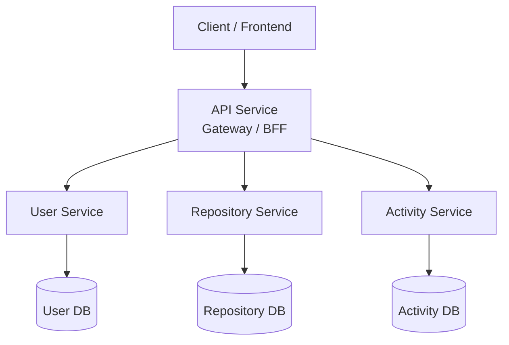
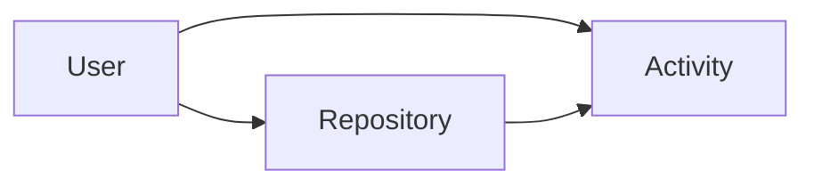
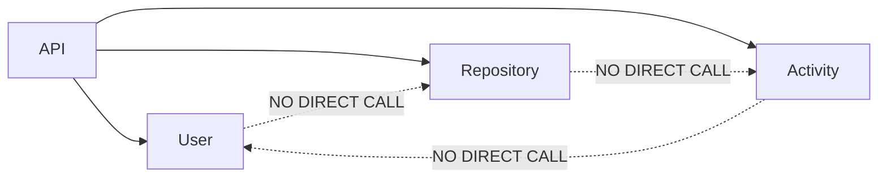
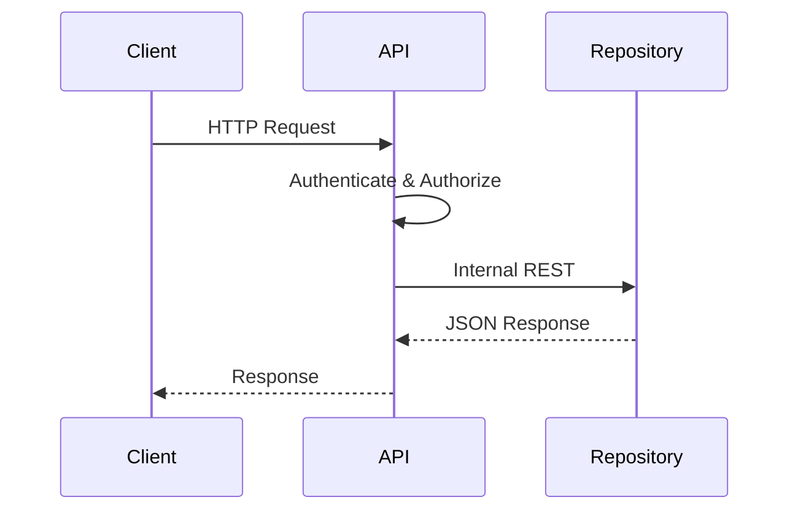
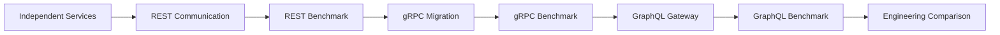
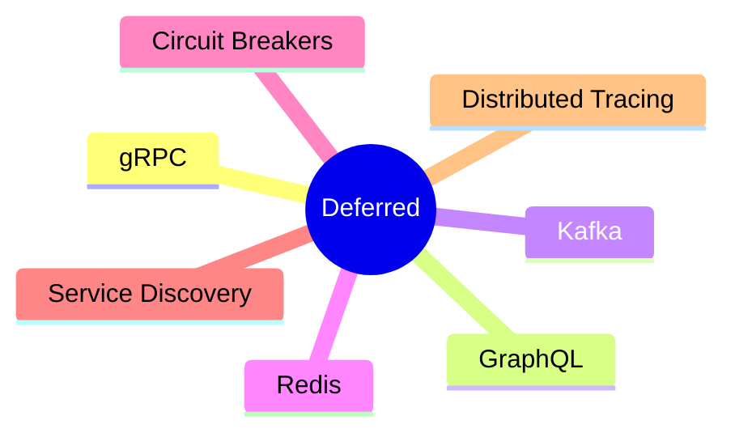

# 01. System Overview

> This document defines the high-level architecture, system boundaries, and long-term evolution of API Communication Lab.

---

# Purpose

API Communication Lab is an engineering project that evaluates different communication mechanisms used in distributed systems.

The business domain intentionally remains stable while the communication layer evolves.

---

# High-Level Architecture

---

# System Goals

- Build production-oriented microservices
- Compare REST, gRPC and GraphQL
- Benchmark communication mechanisms
- Keep business logic constant across implementations
- Demonstrate architecture evolution using measurable evidence

---

# Domain Model

The project models a simplified collaborative development platform.

| Domain | Responsibility |
|----------|----------------|
| User | Profile Management |
| Repository | Repository Metadata |
| Activity | User & Repository Activity Timeline |

---

# Service Boundaries

## Rules

✅ API Service is the only public entry point

✅ Every service owns its own database

✅ Communication happens only through APIs

❌ No shared database

❌ No direct service-to-service communication

---

# Request Lifecycle

---

# Architecture Principles

| Principle | Description |
|------------|-------------|
| Single Responsibility | Each service owns one business capability |
| Database per Service | No shared persistence |
| Loose Coupling | Communication through APIs only |
| API Gateway | Single external entry point |
| Evolutionary Architecture | Communication mechanism changes without changing domains |

---

# Technology Stack

| Layer | Technology |
|--------|------------|
| Language | Java 21 |
| Framework | Spring Boot |
| Build | Gradle Kotlin DSL |
| Database | PostgreSQL |
| ORM | Spring Data JPA |
| API | REST (Stage 1) |
| Documentation | OpenAPI |
| Containers | Docker |

---

# Evolution Roadmap

---

# Out of Scope (Current Phase)

The following technologies are intentionally deferred until the REST baseline is complete.

---

# Success Criteria

The REST stage is considered complete when:

- API Gateway routes all external requests
- Services expose versioned REST APIs
- End-to-end communication is operational
- JWT authentication is handled by the gateway
- Benchmarks can be executed consistently

---

# Related Documents

| Document | Purpose |
|-----------|---------|
| README.md | Documentation Index |
| 02-service-responsibilities.md | Service Ownership |
| 03-rest-architecture.md | REST Communication Design |
| 04-api-contracts.md | Endpoint Specifications |
| 05-security.md | Authentication & Authorization |
| 06-error-handling.md | Error Strategy |
| 07-data-flow.md | Request Flows |
| 08-benchmark-plan.md | Performance Evaluation |
| 09-architecture-decisions.md | Architecture Decision Records |