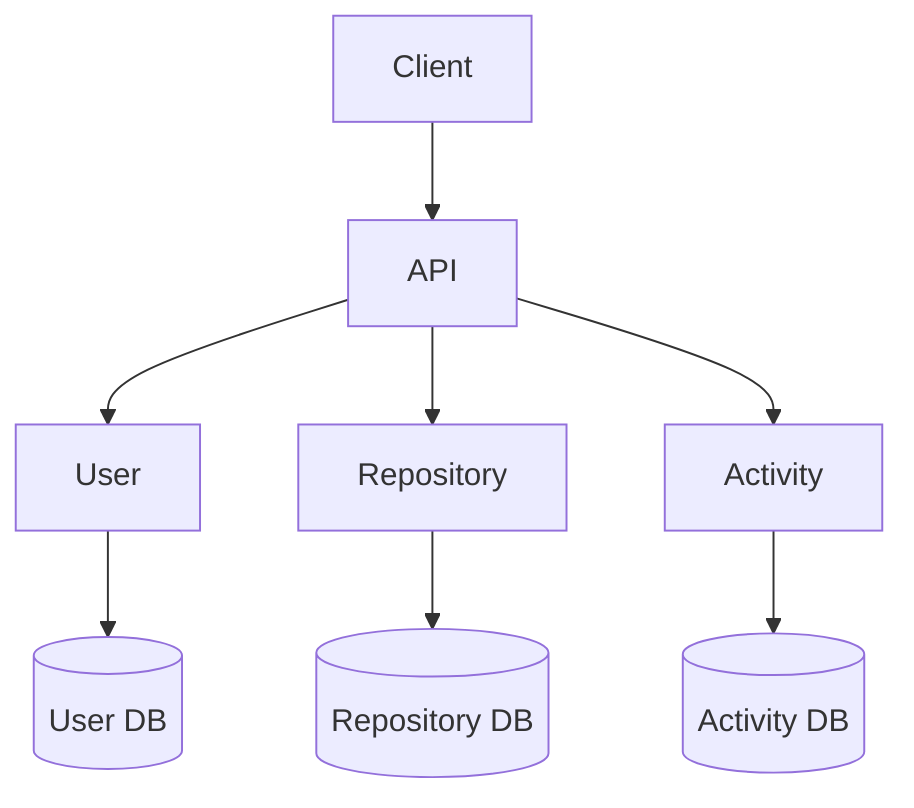
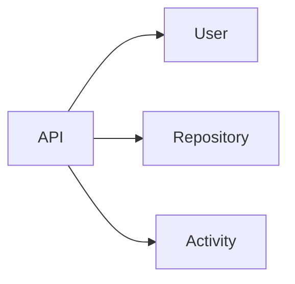
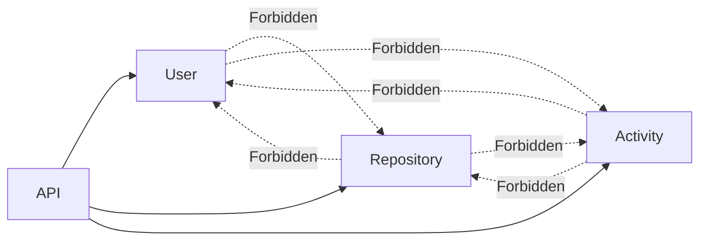
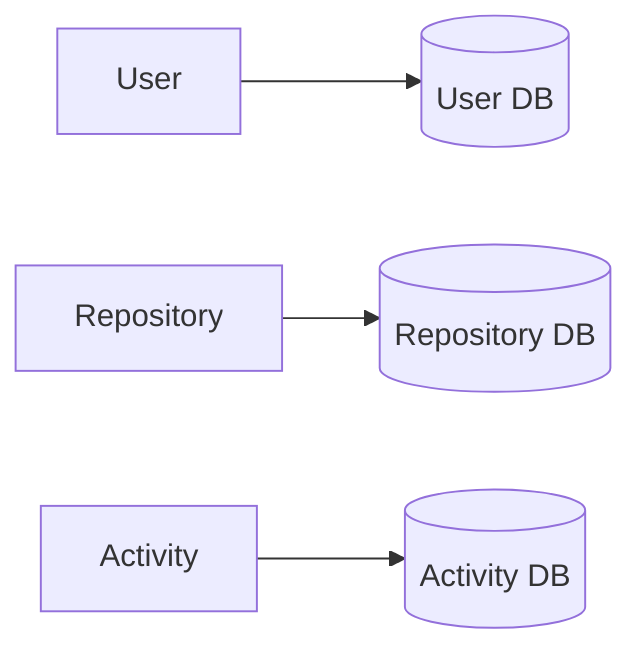
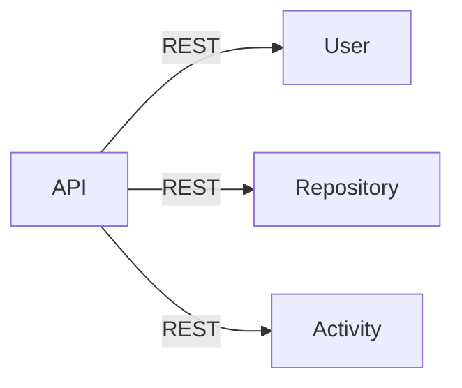
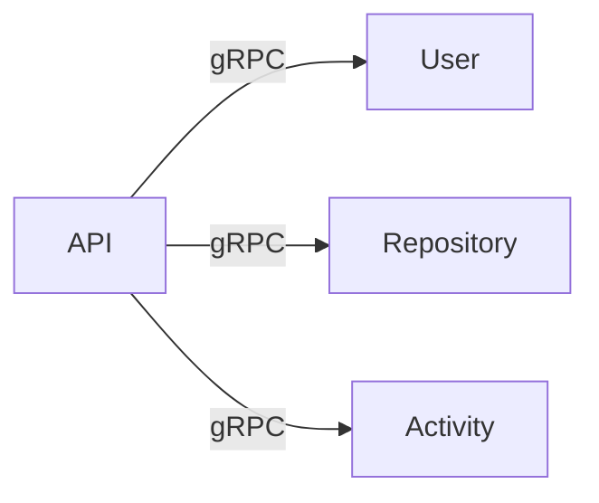

# 02. Service Responsibilities

> Defines ownership boundaries for every service in API Communication Lab.

---

# System Ownership



---

# Ownership Matrix

| Service | Owns | Never Owns |
|----------|------|------------|
| API Service | Authentication, Authorization, Routing, Aggregation | Business Data |
| User Service | User Profiles | Repository or Activity Data |
| Repository Service | Repository Metadata | User Profiles |
| Activity Service | Activity Timeline | User or Repository State |

---

# API Service

## Primary Responsibility

Acts as the single entry point into the system.

---

## Owns

- Authentication
- Authorization
- JWT Validation
- Request Routing
- Response Aggregation
- API Versioning
- Cross-cutting concerns

---

## Never Owns

- User profiles
- Repository metadata
- Activity records
- Business persistence

---

## Depends On



---

# User Service

## Primary Responsibility

Manages user identity and profile information.

---

## Owns

- User Profile
- User Updates
- User Lookup

---

## Database

```text
User Database
```

---

## May Expose

```text
GET    /users/{uuid}

GET    /users/me

PATCH  /users/{uuid}
```

---

## Never Owns

- Repository metadata
- Activity feed
- Authentication
- API routing

---

# Repository Service

## Primary Responsibility

Manages repository information.

---

## Owns

- Repository Metadata
- Repository CRUD
- Repository Visibility
- Repository Ownership

---

## Database

```text
Repository Database
```

---

## May Expose

```text
GET    /repositories

GET    /repositories/{uuid}

POST   /repositories

PATCH  /repositories/{uuid}
```

---

## Never Owns

- User profiles
- Activity history
- Authentication

---

# Activity Service

## Primary Responsibility

Stores and retrieves activity events.

---

## Owns

- Activity Feed
- User Activity History
- Repository Activity

---

## Database

```text
Activity Database
```

---

## May Expose

```text
GET /activities

GET /activities/{uuid}

GET /users/{uuid}/activities

POST /activities
```

---

## Never Owns

- Repository metadata
- User profiles
- Authentication

---

# Communication Rules



## Rules

✅ API Service orchestrates requests

✅ Services communicate only through published APIs

✅ Services never access another service's database

❌ No circular dependencies

❌ No shared persistence

❌ No direct client access

---

# Database Ownership



Ownership is exclusive.

No database may be accessed by another service.

---

# Responsibility Checklist

Before adding a feature, verify:

```text
✓ Which service owns this business capability?

✓ Does another service already own it?

✓ Is the data stored only in the owning service?

✓ Does this require another service call?

✓ Should the API Gateway orchestrate instead?
```

---

# Future Evolution

Current communication



Future



Notice that only the transport changes.

Ownership remains identical.

---

# Related Documents

| Document | Purpose |
|-----------|---------|
| 01-system-overview.md | High-Level Architecture |
| 03-rest-architecture.md | REST Communication |
| 04-api-contracts.md | Public APIs |
| 09-architecture-decisions.md | Ownership Decisions |