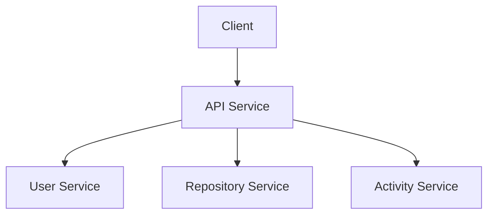
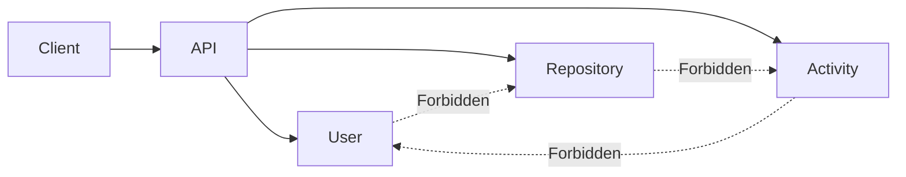
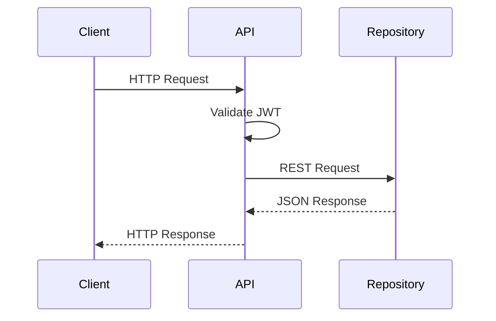
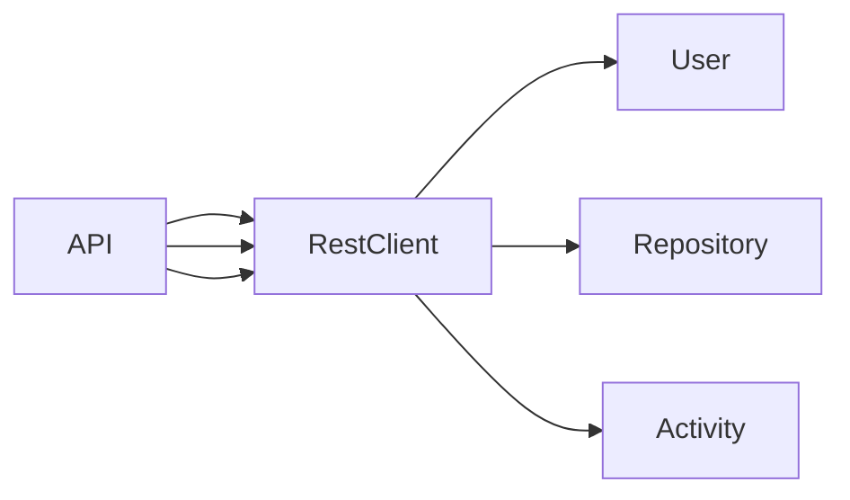
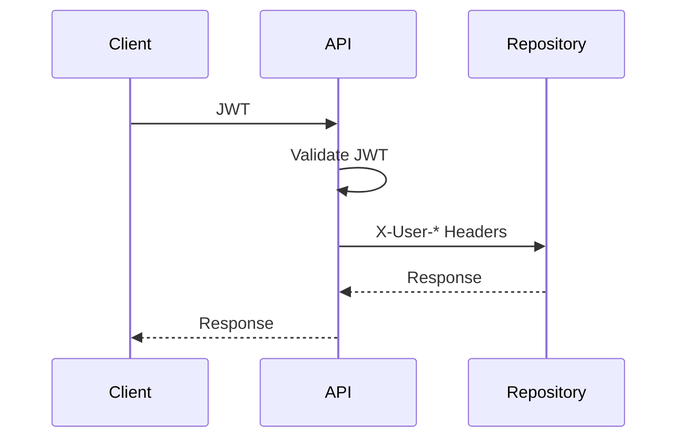
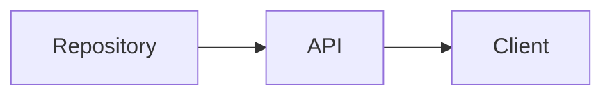
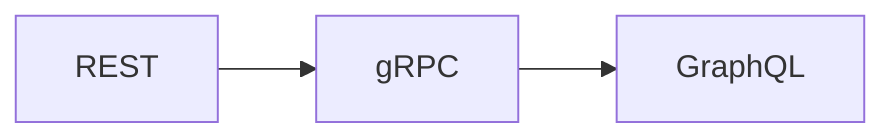

# 03. REST Architecture

> Defines the REST communication model used during Stage 1 of API Communication Lab.

---

# Communication Topology



---

# Why REST?

REST is selected as the baseline communication protocol because it is:

| Reason | Explanation |
|---------|-------------|
| Industry Standard | Widely adopted for synchronous APIs |
| Human Readable | JSON payloads simplify debugging |
| Mature Ecosystem | Excellent Spring Boot support |
| Benchmark Baseline | Establishes performance before introducing gRPC |

REST is **not** chosen because it is the fastest protocol.

It provides the reference implementation for all future comparisons.

---

# Communication Rules



## Rules

✅ API Service orchestrates requests

✅ Services expose REST APIs

✅ Services never call each other

❌ Shared databases

❌ Direct client access

❌ Circular communication

---

# Request Lifecycle



---

# Internal Communication

| Property | Value |
|-----------|-------|
| Protocol | HTTP |
| Payload | JSON |
| Style | Synchronous |
| Transport | REST |
| Authentication | Internal Trusted Headers |
| Response Format | application/json |

---

# API Versioning

Every public endpoint is versioned.

```text
/api/v1/...
```

Example

```text
GET /api/v1/users/{uuid}

GET /api/v1/repositories/{uuid}

GET /api/v1/activities/{uuid}
```

---

# URL Naming Convention

| Resource | Pattern |
|-----------|---------|
| Collection | `/users` |
| Single Resource | `/users/{uuid}` |
| Nested Resource | `/users/{uuid}/activities` |

Rules

- nouns only
- lowercase
- plural resources
- UUID in URLs
- no verbs

---

# HTTP Client



## Selected Client

| Client | Decision |
|----------|----------|
| RestClient (Spring Boot 3.2+) | ✅ Selected |
| RestTemplate | ❌ Deprecated |
| WebClient | ❌ Reserved for reactive workloads |

---

# Request Headers

Internal requests propagate selected metadata.

| Header | Purpose |
|----------|---------|
| X-User-Id | Internal User ID |
| X-User-UUID | External User UUID |
| X-Correlation-Id | Request tracing |
| X-Request-Id | Request identification |

JWT is **not forwarded** to downstream services.

---

# Authentication Flow



The API Service is the trust boundary.

Downstream services trust authenticated requests originating from the gateway.

---

# Error Propagation



Rules

- Preserve HTTP status codes
- Preserve business error codes
- Add correlation ID to logs
- Do not expose internal stack traces

---

# Timeout Strategy

| Property | Value |
|-----------|-------|
| Connection Timeout | 2 seconds |
| Read Timeout | 5 seconds |

Requests exceeding the timeout fail fast.

---

# Retry Strategy

Current Stage

```text
No Automatic Retries
```

Reason

Retries may hide latency problems and distort benchmark results.

Retry policies will be introduced after the REST baseline has been established.

---

# Observability

Every request receives a unique correlation identifier.

```mermaid
flowchart LR

Client

↓

API

↓

Repository

↓

API

↓

Client
```

All services log:

- Correlation ID
- Request Path
- Response Status
- Processing Time

---

# Migration Strategy

Only the transport layer changes.

Business APIs remain stable.



This allows performance comparisons without redesigning business domains.

---

# Key Decisions

| Decision | Reason |
|----------|--------|
| REST | Baseline implementation |
| API Gateway | Central orchestration |
| RestClient | Modern synchronous HTTP client |
| JSON | Human-readable payload |
| No Retries | Accurate benchmarking |
| Versioned APIs | Future compatibility |
| Trusted Headers | Avoid repeated JWT validation |

---

# Related Documents

| Document | Purpose |
|----------|---------|
| 02-service-responsibilities.md | Service ownership |
| 04-api-contracts.md | Endpoint definitions |
| 05-security.md | Authentication model |
| 07-data-flow.md | Request sequences |
| 08-benchmark-plan.md | Performance evaluation |