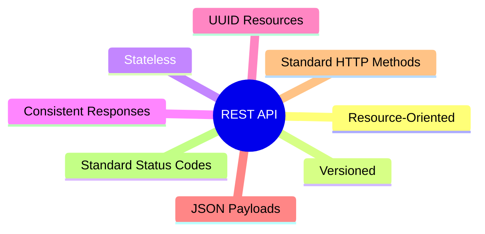

# 04. API Design Guidelines

> Defines the API design standards followed across all microservices.

---

# API Philosophy

The REST APIs in API Communication Lab follow a resource-oriented design.

Business resources are represented as nouns, while HTTP methods express the intended operation.

The objective is consistency across every service rather than service-specific conventions.

---

# Base URL

```text
/api/v1
```

Every externally exposed endpoint is versioned.

Examples

```text
/api/v1/users
/api/v1/repositories
/api/v1/activities
```

---

# URI Design

## Resource Naming

| Rule | Example |
|------|---------|
| Lowercase | `/users` |
| Plural Resources | `/repositories` |
| UUID Path Variable | `/repositories/{uuid}` |
| Nested Resources | `/users/{uuid}/activities` |

---

## Avoid

```text
/createUser
/getRepository
/deleteActivity
/updateProfile
```

REST endpoints should represent resources rather than actions.

---

# HTTP Methods

| Method | Usage |
|---------|------|
| GET | Retrieve resources |
| POST | Create resources |
| PATCH | Partial update |
| DELETE | Soft delete (future) |

PUT is intentionally avoided in the current implementation since all updates are partial.

---

# Versioning Strategy

```text
/api/v1/*
```

Future breaking changes

```text
/api/v2/*
```

Rules

- Never modify existing contracts.
- Introduce a new version for breaking changes.
- Optional fields may be added without version changes.

---

# Resource Identification

Every externally visible resource is identified by a UUID.

```text
/users/{uuid}

/repositories/{uuid}

/activities/{uuid}
```

Internal database IDs remain private.

---

# Request Format

Requests use JSON.

Example

```json
{
    "name": "API Communication Lab"
}
```

---

# Success Response

Every successful response follows the same structure.

```json
{
    "timestamp": "...",
    "status": 200,
    "message": "...",
    "data": {},
    "path": "/api/v1/..."
}
```

---

# Error Response

Every failed request follows the same structure.

```json
{
    "timestamp": "...",
    "status": 404,
    "error": "Not Found",
    "message": "...",
    "path": "/api/v1/..."
}
```

---

# HTTP Status Codes

| Status | Usage |
|----------|------|
| 200 | Successful retrieval |
| 201 | Resource created |
| 204 | Successful deletion |
| 400 | Validation failure |
| 401 | Authentication required |
| 403 | Authorization failure |
| 404 | Resource not found |
| 409 | Business conflict |
| 500 | Unexpected error |

---

# Validation

Validation failures return

```text
HTTP 400
```

Business rule violations return

```text
HTTP 409
```

Missing resources return

```text
HTTP 404
```

---

# Pagination (Future)

Collection endpoints will support

```text
?page=0

&size=20

&sort=name,asc
```

Example

```text
GET /repositories?page=0&size=20
```

---

# Filtering (Future)

Example

```text
GET /repositories?visibility=PUBLIC

GET /activities?type=PUSH
```

Filtering should use query parameters rather than additional endpoints.

---

# Idempotency

| Method | Idempotent |
|----------|------------|
| GET | ✅ |
| POST | ❌ |
| PATCH | ✅ |
| DELETE | ✅ |

Future POST endpoints handling financial or critical operations may introduce an `Idempotency-Key` header.

---

# Authentication

Public clients send

```text
Authorization: Bearer <JWT>
```

The JWT is validated only by the API Service.

Downstream services receive trusted internal headers instead of the original JWT.

---

# API Documentation

Swagger / OpenAPI is the source of truth for endpoint definitions.

This document defines only the architectural standards used to design those APIs.

---

# Design Principles



---

# Checklist

Before exposing a new endpoint verify:

- Resource uses a noun.
- Endpoint is versioned.
- UUID is externally visible.
- Response uses the standard wrapper.
- Correct HTTP method is used.
- Correct status code is returned.
- OpenAPI documentation is updated.
- Ownership matches `02-service-responsibilities.md`.

---

# Related Documents

| Document | Purpose |
|-----------|---------|
| 02-service-responsibilities.md | Service ownership |
| 03-rest-architecture.md | Communication architecture |
| 05-security.md | Authentication model |
| OpenAPI Specification | Endpoint documentation |