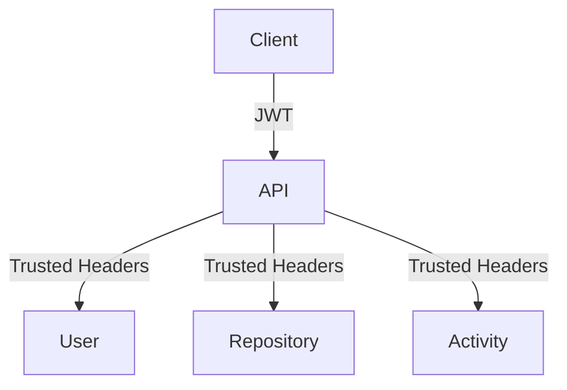
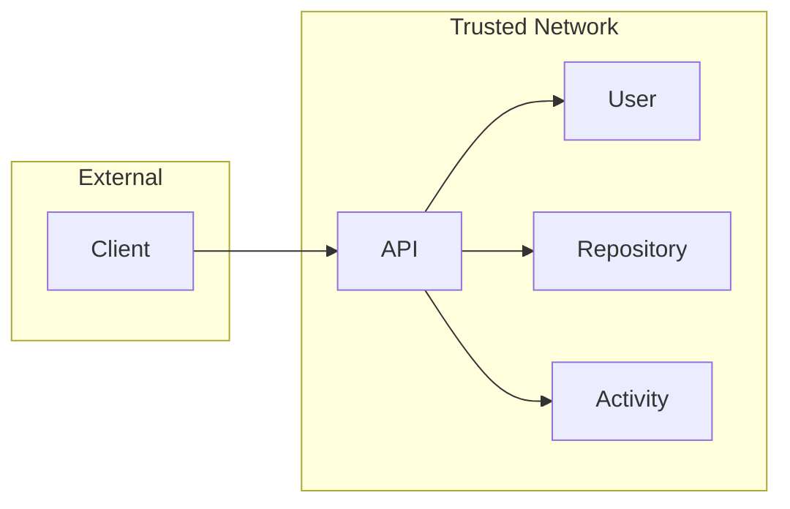
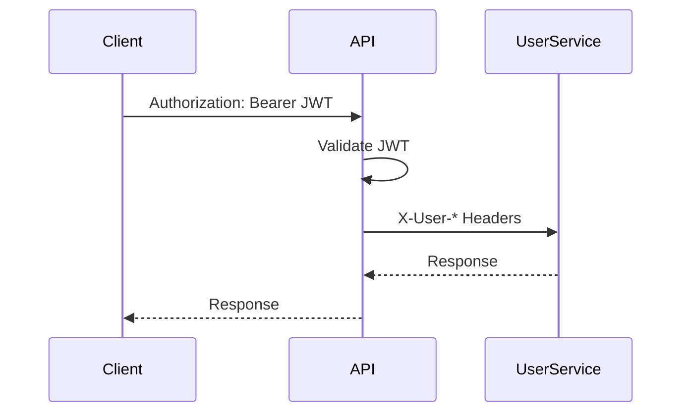
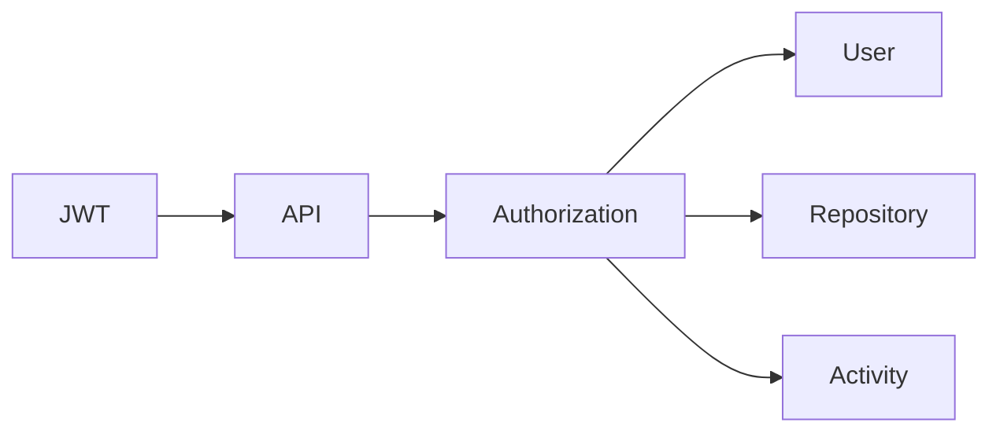
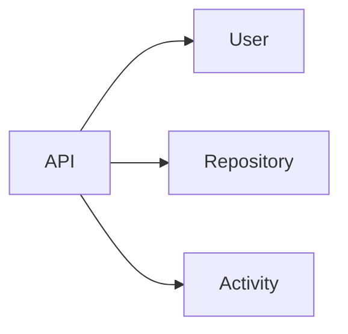
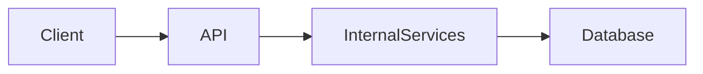

# 05. Security Architecture

> Defines the authentication, authorization, and trust model used throughout API Communication Lab.

---

# Security Topology



---

# Trust Boundary



The **API Service** is the security boundary of the system.

Only authenticated requests are forwarded to downstream services.

---

# Authentication Flow



---

# Authentication Strategy

| Responsibility | Owner |
|---------------|--------|
| Login | API Service |
| JWT Validation | API Service |
| Authorization | API Service |
| User Identity Propagation | API Service |
| Business Logic | Domain Services |

---

# Identity Propagation

After successful authentication, the gateway propagates user identity using internal headers.

| Header | Purpose |
|----------|---------|
| X-User-Id | Internal numeric identifier |
| X-User-UUID | Public UUID |
| X-Username | Authenticated username |
| X-User-Roles | Authorization roles |
| X-Correlation-Id | Request tracing |

These headers are trusted because they originate from the gateway.

---

# Why JWT Is Not Forwarded

## Decision

JWTs terminate at the API Service.

Downstream services never parse or validate JWTs.

---

## Benefits

| Benefit | Explanation |
|----------|-------------|
| Single Trust Boundary | Authentication logic exists in one place |
| Less Duplication | Services don't implement JWT parsing |
| Easier Migration | Internal transport becomes independent of authentication |
| Better Performance | Token parsed only once |

---

# Authorization Model



Authorization decisions occur before forwarding requests.

Unauthorized requests never reach downstream services.

---

# Service Trust Model



Domain services trust requests only from the API Service.

They never authenticate external clients directly.

---

# Communication Security

| Layer | Mechanism |
|---------|-----------|
| Client → API | JWT |
| API → Services | Trusted Internal Headers |
| Payload | JSON |
| Transport | HTTP (HTTPS in production) |

---

# Public vs Internal APIs



| API | Accessible By |
|------|---------------|
| Public REST APIs | Clients |
| Internal REST APIs | API Service only |

---

# Security Rules

| Rule | Status |
|------|--------|
| JWT validated once | ✅ |
| Gateway is trust boundary | ✅ |
| Internal services trust gateway | ✅ |
| Business services never parse JWT | ✅ |
| Client never reaches internal services | ✅ |
| Internal headers never accepted from external clients | ✅ |

---

# Future Evolution

Current

```text
Client
   │
 JWT
   │
API
   │
REST
   │
Services
```

Future

```text
Client
   │
 JWT
   │
GraphQL Gateway
   │
gRPC
   │
Services
```

Authentication remains unchanged.

Only the communication protocol evolves.

---

# Security Checklist

Before implementing a secured endpoint verify:

- Authentication occurs at the gateway.
- Authorization is evaluated before forwarding.
- JWT is never forwarded downstream.
- Internal identity is propagated using trusted headers.
- Domain services contain no authentication logic.

---

# Related Documents

| Document | Purpose |
|----------|---------|
| 03-rest-architecture.md | Communication model |
| 04-api-design-guidelines.md | API standards |
| 06-error-handling.md | Error responses |
| 09-architecture-decisions.md | Security decisions |