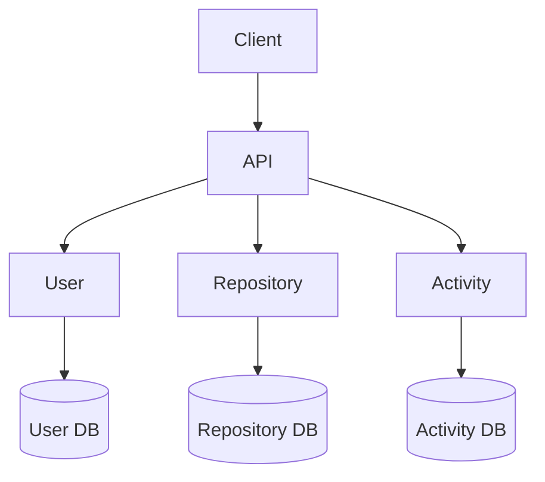
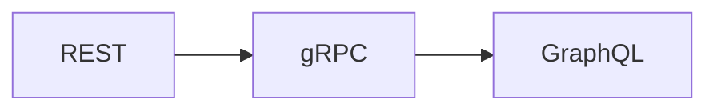

# 07. Data Flow

> This document serves as the entry point for all request lifecycle documentation.

As the project evolves, request flows become increasingly complex with the introduction of gRPC, GraphQL, caching, asynchronous messaging, and resiliency patterns.

To keep the documentation modular, each major request lifecycle is documented separately.

---

# Data Flow Overview

---

# Documentation Structure

| Document | Purpose |
|----------|---------|
| authentication-flow.md | Authentication and authorization lifecycle |
| repository-flow.md | Repository request lifecycle |
| user-flow.md | User management lifecycle |
| activity-flow.md | Activity service lifecycle |
| error-flow.md | Error propagation across services |
| communication-matrix.md | Allowed communication paths |
| future-evolution.md | REST → gRPC → GraphQL evolution |

---

# Communication Principles

- Every external request enters through the API Service.
- Every service owns its own database.
- Services never access another service's database.
- Business services never communicate directly.
- Identity is propagated using the Internal Identity Context.

---

# Evolution Strategy

As communication mechanisms evolve, only the transport layer changes.

Business workflows remain unchanged.

---

# Related Documents

| Document | Purpose |
|----------|---------|
| 03-rest-architecture.md | Communication architecture |
| 05-security.md | Authentication model |
| 06-error-handling.md | Failure handling |
| data-flows/README.md | Detailed request flows |