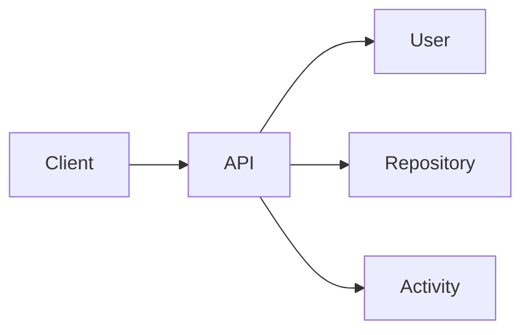

# ADR-001 — API Gateway as the Single Entry Point

## Status

Accepted

## Date

2026-07-17

## Context

The system consists of multiple independent microservices. Exposing every service directly would tightly couple clients to the internal architecture and duplicate authentication, routing, and versioning logic.

## Decision

All external traffic enters through the API Service.

## Alternatives Considered

| Alternative | Reason Rejected |
|-------------|-----------------|
| Client communicates with every service | Tight client coupling and duplicated authentication |
| Multiple public services | Harder API evolution and security |

## Consequences

### Positive

- Single authentication boundary
- Centralized routing
- Easier monitoring
- Simpler clients
- Future GraphQL integration becomes straightforward

### Negative

- Additional network hop
- Gateway becomes a critical component
