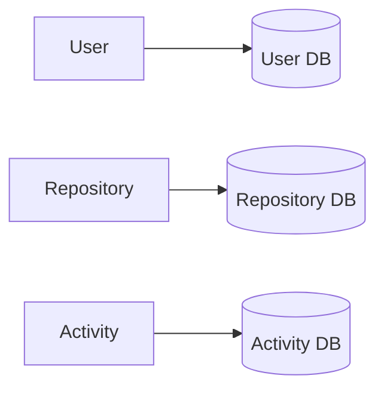

# ADR-002 — Database per Service

## Status

Accepted

## Date

2026-07-17

## Context

Each service represents an independent business capability.

Sharing a database would violate ownership boundaries and tightly couple services.

## Decision

Every service owns its own persistence layer.

## Alternatives Considered

| Alternative | Reason Rejected |
|-------------|-----------------|
| Shared database | Tight coupling, difficult independent evolution |
| Shared schema | Breaks service ownership |

## Consequences

### Positive

- Independent deployment
- Independent schema evolution
- Loose coupling
- Better scalability

### Negative

- Cross-service joins become API calls
- Data duplication may be required later
