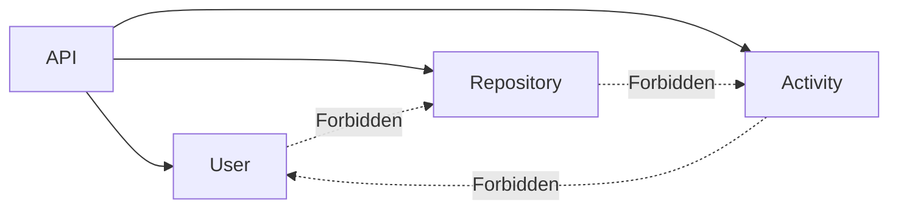

# ADR-003 — Gateway-Orchestrated Communication

## Status

Accepted

## Date

2026-07-17

## Context

Allowing unrestricted service-to-service communication creates dependency chains and makes protocol comparisons difficult.

## Decision

The API Service orchestrates all communication.

Business services never invoke each other.

## Alternatives Considered

| Alternative | Reason Rejected |
|-------------|-----------------|
| Free service-to-service communication | Higher coupling and harder benchmarking |
| Chained requests | More difficult tracing and debugging |

## Consequences

### Positive

- Clear ownership
- Simplified architecture
- Easier migration to gRPC
- Easier benchmarking

### Negative

- API Service performs orchestration
- Some workflows require multiple downstream calls
