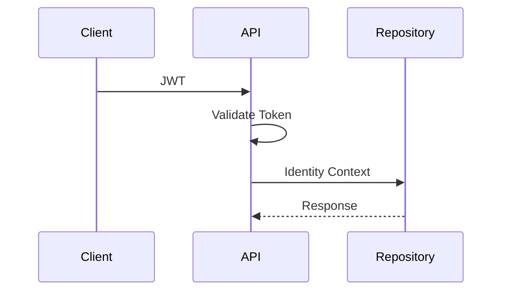

# ADR-004 — JWT Validation at the Gateway

## Status

Accepted

## Date

2026-07-17

## Context

Validating JWTs in every service duplicates authentication logic and increases maintenance effort.

## Decision

JWT validation occurs only within the API Service.

Authenticated identity is propagated internally.

## Alternatives Considered

| Alternative | Reason Rejected |
|-------------|-----------------|
| JWT validation in every service | Duplicate logic and inconsistent security |
| Shared authentication library | Still requires validation everywhere |

## Consequences

### Positive

- Single trust boundary
- Simplified downstream services
- Better performance
- Easier protocol migration

### Negative

- Downstream services trust the gateway
