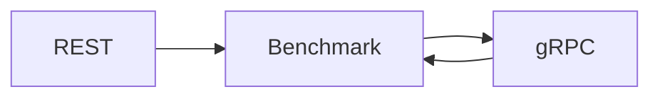

# ADR-005 — REST Before gRPC

## Status

Accepted

## Date

2026-07-17

## Context

The project aims to compare communication technologies objectively.

Without a baseline, improvements cannot be measured.

## Decision

Complete the REST implementation before introducing gRPC.

## Alternatives Considered

| Alternative | Reason Rejected |
|-------------|-----------------|
| Build REST and gRPC together | Impossible to isolate performance improvements |
| Start directly with gRPC | No baseline comparison |

## Consequences

### Positive

- Objective benchmarks
- Controlled evolution
- Easier debugging

### Negative

- Temporary duplicate implementation
