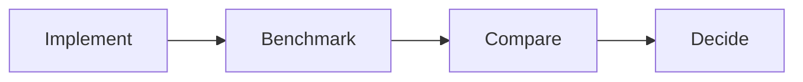

# ADR-010 — Benchmark Before Optimization

## Status

Accepted

## Date

2026-07-17

## Context

Performance improvements should be demonstrated using measurable evidence rather than assumptions.

## Decision

Every major architectural evolution is benchmarked before and after implementation.

## Alternatives Considered

| Alternative | Reason Rejected |
|-------------|-----------------|
| Optimize without measurement | Results cannot be justified |
| Benchmark only final implementation | No historical comparison |

## Consequences

### Positive

- Evidence-driven decisions
- Reproducible results
- Meaningful engineering comparisons

### Negative

- Additional benchmarking effort
