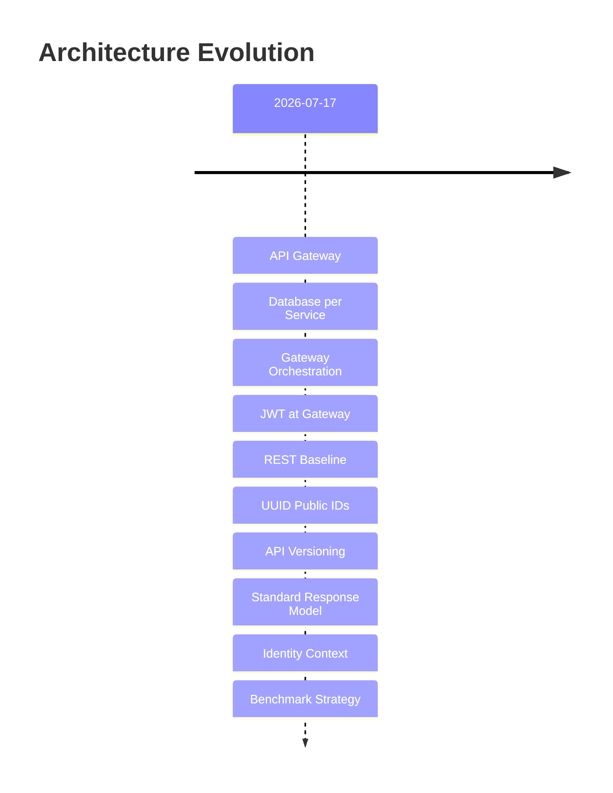

# Architecture Decision Records

> This directory contains all Architecture Decision Records (ADRs) for **API Communication Lab**.
>
> Each ADR captures a single significant decision: its context, rationale, alternatives, and consequences.

---

## ADR Index

| ADR | Title | Status |
|-----|-------|--------|
| [ADR-001](ADR-001-api-gateway.md) | API Gateway as the Single Entry Point | Accepted |
| [ADR-002](ADR-002-database-per-service.md) | Database per Service | Accepted |
| [ADR-003](ADR-003-gateway-orchestration.md) | Gateway-Orchestrated Communication | Accepted |
| [ADR-004](ADR-004-jwt-at-gateway.md) | JWT Validation at the Gateway | Accepted |
| [ADR-005](ADR-005-rest-baseline.md) | REST Before gRPC | Accepted |
| [ADR-006](ADR-006-public-uuid.md) | UUID as Public Identifier | Accepted |
| [ADR-007](ADR-007-api-versioning.md) | Versioned REST APIs | Accepted |
| [ADR-008](ADR-008-response-envelope.md) | Standard Response Envelope | Accepted |
| [ADR-009](ADR-009-identity-context.md) | Transport-Independent Identity Context | Accepted |
| [ADR-010](ADR-010-benchmark-first.md) | Benchmark Before Optimization | Accepted |

---

## ADR Timeline

---

## Revision Policy

Architecture decisions are immutable once accepted.

If a decision changes in the future:

- Do **not** modify the original ADR.
- Create a new ADR referencing the previous one.
- Mark the previous ADR as **Superseded** if applicable.

This preserves the architectural history and the reasoning behind the system's evolution.
