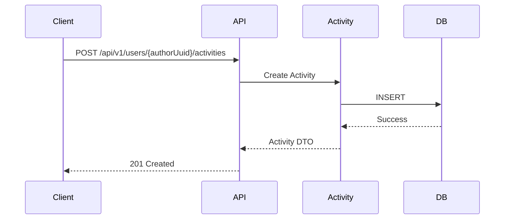
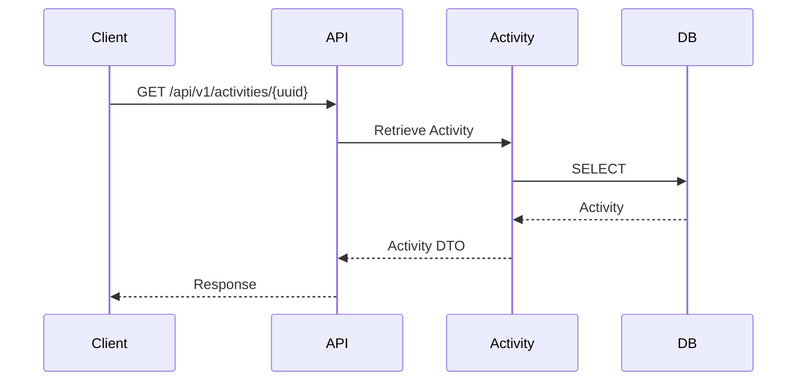
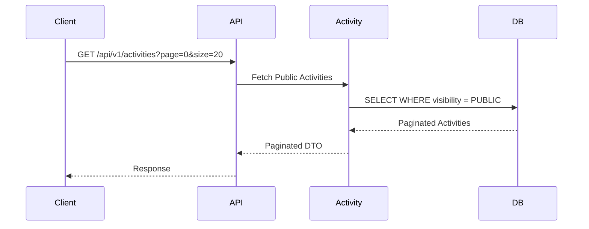
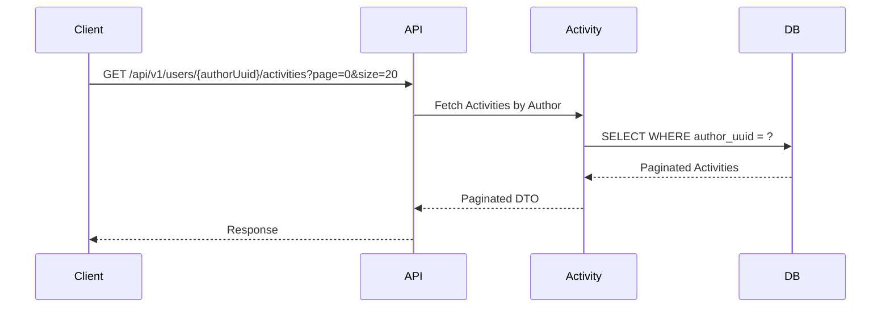
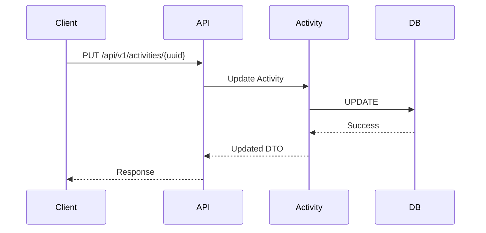
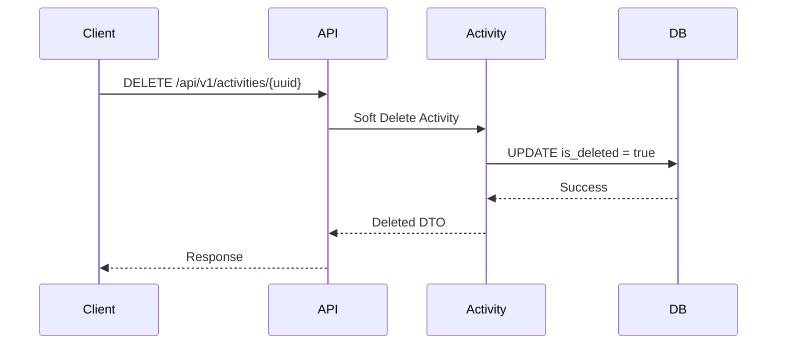

# Activity Flow

> Documents the request lifecycle for activity management.

---

# Record Activity

---

# Retrieve Activity

---

# List Public Feed

---

# List User Activity Feed

---

# Update Activity

---

# Delete Activity (Soft Delete)

---

# Related ADRs

- [ADR-003 — Gateway-Orchestrated Communication](../adr/ADR-003-gateway-orchestration.md)
- [ADR-006 — UUID as Public Identifier](../adr/ADR-006-public-uuid.md)
- [ADR-008 — Standard Response Envelope](../adr/ADR-008-response-envelope.md)
