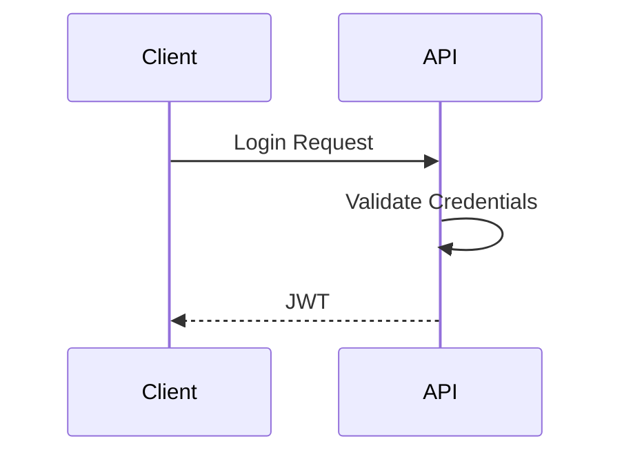
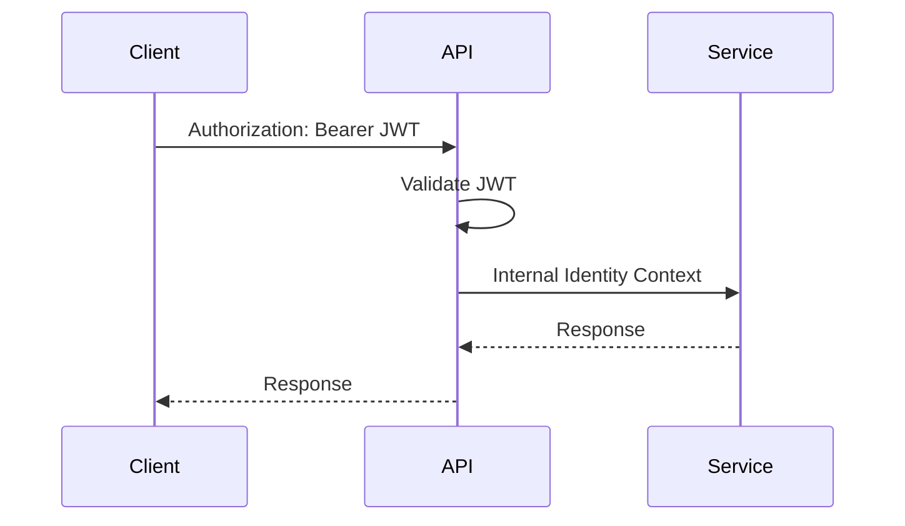

# Authentication Flow

> Documents the authentication lifecycle from login to authenticated service requests.

---

# Login Flow

---

# Authenticated Request

---

# Key Decisions

- JWT validated only at the gateway.
- Services trust the gateway.
- Identity propagated independently of transport.

---

# Related ADRs

- [ADR-001 — API Gateway as the Single Entry Point](../adr/ADR-001-api-gateway.md)
- [ADR-004 — JWT Validation at the Gateway](../adr/ADR-004-jwt-at-gateway.md)
- [ADR-009 — Transport-Independent Identity Context](../adr/ADR-009-identity-context.md)
