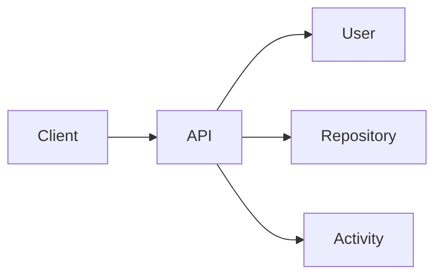
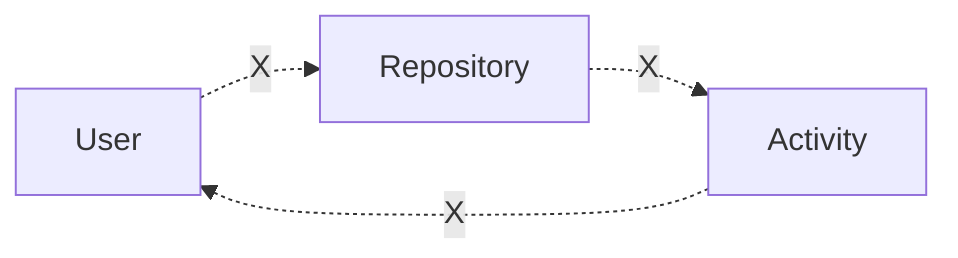
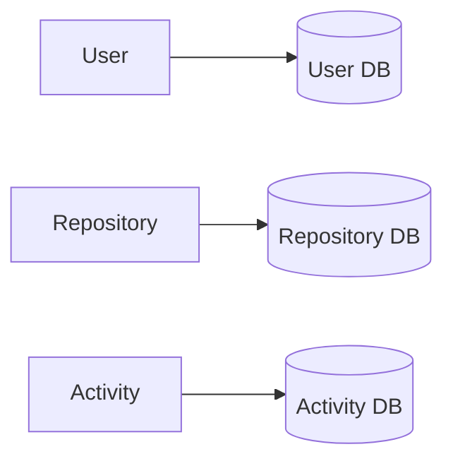
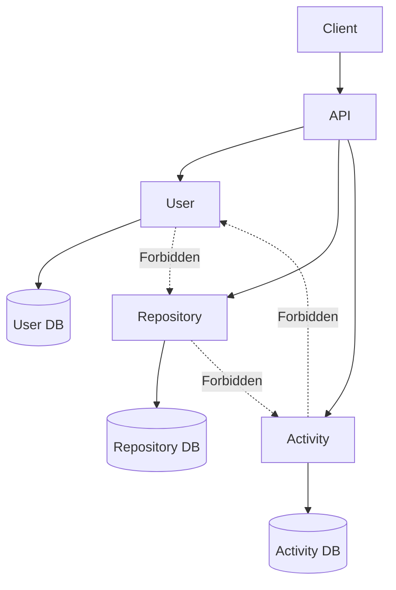

# Communication Matrix

> Defines allowed and forbidden communication paths within the system.

---

# Allowed Communication

---

# Forbidden Communication

These interactions are intentionally prohibited at every stage of the architecture's evolution.

---

# Database Ownership

Each service is the **only** component permitted to read from or write to its own database.

---

# Full Communication Map

---

# Service Ownership

| Service | Owns | Does Not Access |
|----------|------|-----------------|
| API | Routing, Authentication, Aggregation | Business Data |
| User | User Domain & User DB | Repository DB, Activity DB |
| Repository | Repository Domain & Repository DB | User DB, Activity DB |
| Activity | Activity Domain & Activity DB | User DB, Repository DB |

---

# Rules

| Rule | Status |
|------|--------|
| API Service is the only public entry point | ✅ |
| Every service owns its own database | ✅ |
| Business services communicate only through API Service | ✅ |
| No direct service-to-service calls | 🚫 |
| No shared databases | 🚫 |
| No circular dependencies | 🚫 |

---

# Related ADRs

- [ADR-001 — API Gateway as the Single Entry Point](../adr/ADR-001-api-gateway.md)
- [ADR-002 — Database per Service](../adr/ADR-002-database-per-service.md)
- [ADR-003 — Gateway-Orchestrated Communication](../adr/ADR-003-gateway-orchestration.md)
