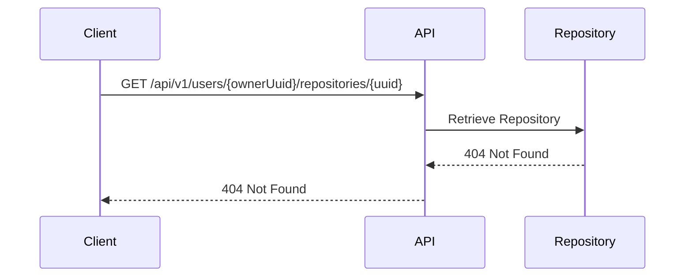
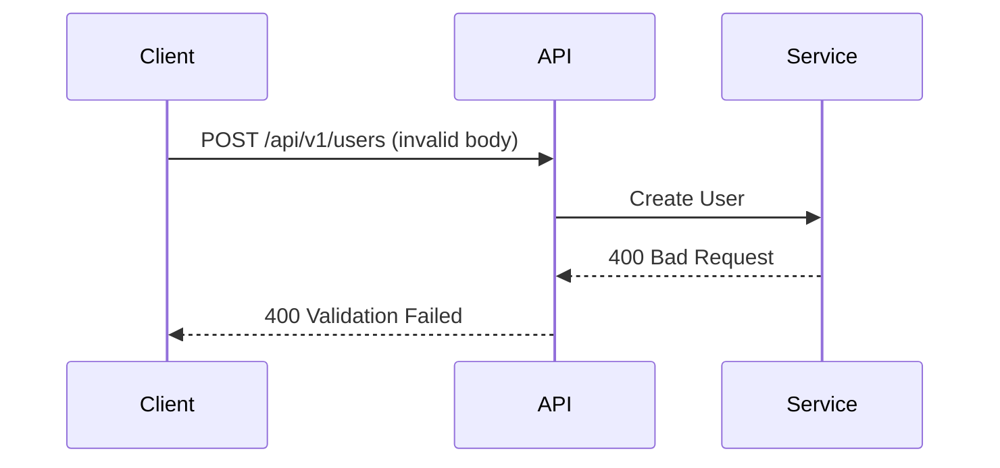
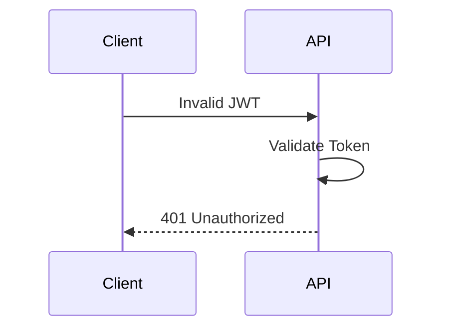
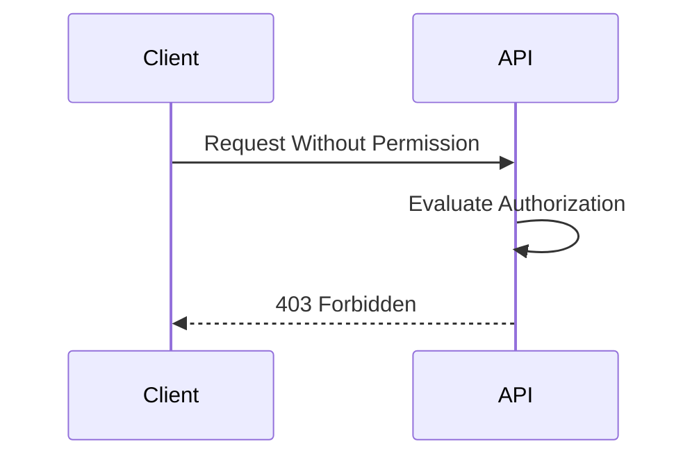
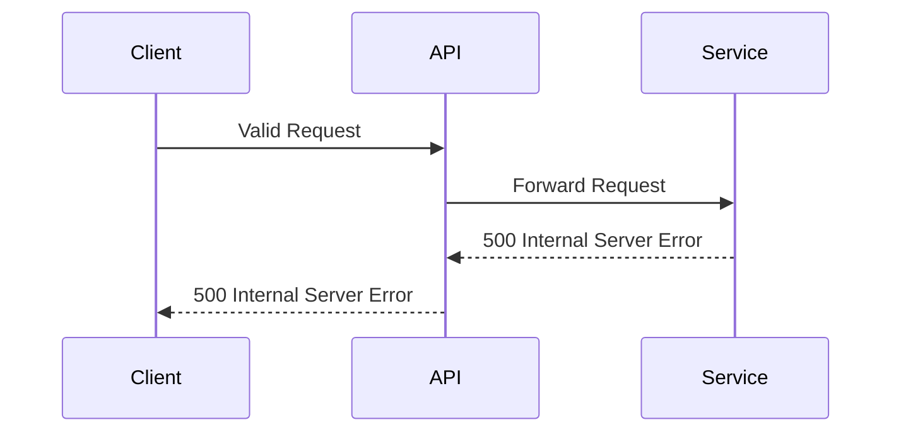

# Error Flow

> Documents how failures propagate through the system.

---

# Resource Not Found



---

# Validation Failure



---

# Authentication Failure



Repository Service is never contacted.

---

# Authorization Failure



---

# Unexpected Error



---

# Standard Error Response

Every error follows this structure:

```json
{
  "timestamp": "2026-07-17T14:30:00Z",
  "status": 404,
  "error": "NOT_FOUND",
  "message": "Repository not found with uuid: ...",
  "path": "/api/v1/users/.../repositories/..."
}
```

---

# Principles

- Errors originate at the owning service.
- API Service preserves error semantics.
- Stack traces are never exposed.
- Standard `ErrorResponse` is always returned.
- Correlation ID is included in logs.

---

# Related ADRs

- [ADR-004 — JWT Validation at the Gateway](../adr/ADR-004-jwt-at-gateway.md)
- [ADR-008 — Standard Response Envelope](../adr/ADR-008-response-envelope.md)
