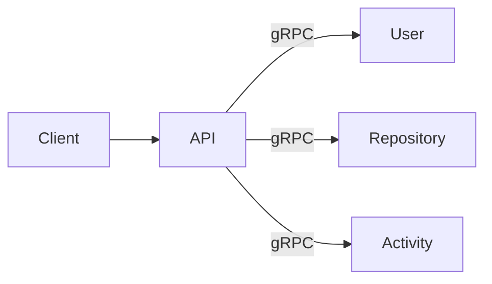
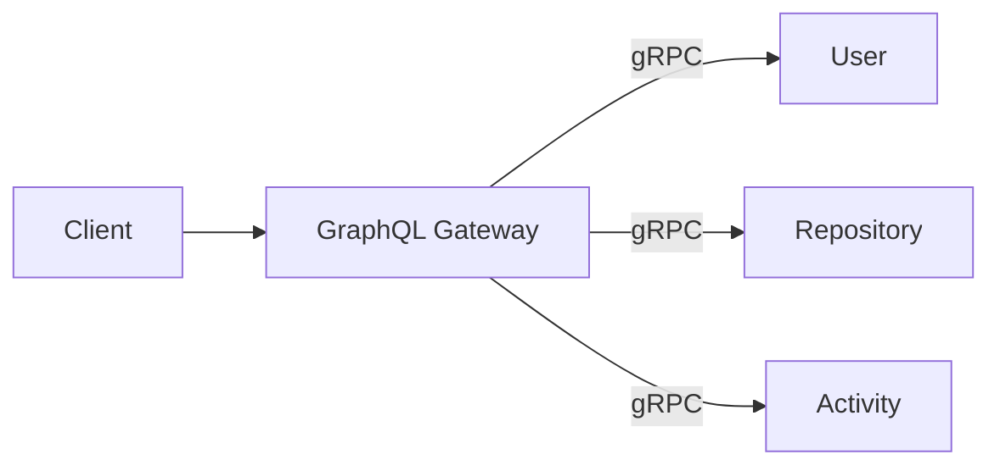
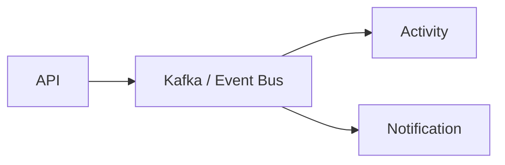

# Future Evolution

> Documents how request flows evolve as new communication mechanisms are introduced.

---

# Communication Evolution

---

# Stage 1 — REST (Current)

Business logic is complete. Communication is HTTP + JSON.

---

# Stage 2 — gRPC Internal Transport

Only the internal transport changes. The client-facing API and business logic remain identical.

---

# Stage 3 — GraphQL Gateway

The API Service is replaced by a GraphQL gateway. gRPC remains the internal transport.

---

# Stage 4 — Event-Driven (Future)

Asynchronous messaging is introduced for non-critical operations such as activity recording and notifications.

---

# Evolution Principles

| Stage | What Changes | What Stays the Same |
|---------|--------------|---------------------|
| REST → gRPC | Internal transport | Business logic, service boundaries, databases |
| gRPC → GraphQL | API aggregation layer | Internal transport, service boundaries |
| GraphQL → Events | Async workflows | Synchronous paths, business logic |

Business workflows remain unchanged throughout every stage.

---

# Future Flow Documents

As each stage is implemented, new flow documents will be added to this directory:

| Future Document | Purpose |
|-----------------|---------|
| grpc-flow.md | gRPC request lifecycle |
| graphql-flow.md | GraphQL query resolution |
| cache-flow.md | Redis caching layer |
| event-flow.md | Kafka event publishing and consumption |
| retry-flow.md | Retry and backoff strategies |
| circuit-breaker-flow.md | Circuit breaker patterns |

---

# Related ADRs

- [ADR-005 — REST Before gRPC](../adr/ADR-005-rest-baseline.md)
- [ADR-009 — Transport-Independent Identity Context](../adr/ADR-009-identity-context.md)
- [ADR-010 — Benchmark Before Optimization](../adr/ADR-010-benchmark-first.md)
