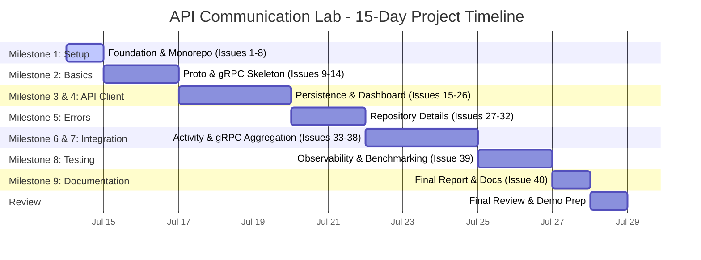

# API Communication Lab: 15-Day Milestone Timeline

This document maps the **15-Day Project Schedule** to the **9 Milestones** and **40 Issues** of the **API Communication Lab**. Use this timeline to manage daily tasks, track progress, and ensure a structured path toward the final project submission and demonstration.

---

## 📅 Timeline Overview

---

## 🗺️ Milestone Mapping Matrix

Below is the mapping between the generic 8-milestone structure requested and the specific milestones implemented in the **API Communication Lab**:

| Timeline Milestone | Est. Duration | Lab Milestone (Actual Build Phase) | Scope & Key Focus |
| :--- | :---: | :--- | :--- |
| **1. Project Setup** | **Day 1** | **M1: Foundation and Gradle Monorepo** | Initialize Kotlin DSL Gradle project, configure subservices, set up databases via Docker Compose. |
| **2. API Basics** | **Days 2–3** | **M2: Proto Contracts and gRPC Skeleton** | Define shared protobuf contracts and build the first REST-to-gRPC external boundary flow. |
| **3. API Client Module** | **Days 4–6** | **M3: Persistence and Seed Data** **M4: Scenario 1 - Developer Dashboard** | Implement database tables, JPA layers, and seed data. Build core REST & GraphQL aggregator interfaces. |
| **4. Error Handling** | **Days 7–8** | **M5: Scenario 2 - Repository Details** | Model client projections (web/mobile). Implement error mappings, record validation, and partial aggregation failure resilience. |
| **5. Integration** | **Days 9–11** | **M6: Activity Feed & Streaming** **M7: gRPC Aggregation Baseline** | Implement paginated queries and gRPC server streaming. Expose scenario-level gRPC aggregation gateway endpoints. |
| **6. Testing** | **Days 12–13** | **M8: Observability & Benchmarking** | Run cross-protocol consistency assertions. Perform performance benchmarking using k6 (REST/GraphQL) and ghz (gRPC). |
| **7. Documentation** | **Day 14** | **M9: Final Comparison & Docs** | Document Architectural Decision Records (ADRs) and compose the final performance/trade-off report. |
| **8. Final Review** | **Day 15** | **Polish, Review & Demo Preparation** | Perform workspace cleanup, linting, verify all tests, and prepare demonstration scripts. |

---

## 📝 Day-by-Day Implementation Plan

### 🚀 Phase 1: Setup & Fundamentals (Days 1–3)

#### **Day 1: Project Setup (Milestone 1)**
* **Objective:** Establish the development environment, project structure, and services.
* **Issues to Complete:**
  * [x] **[Issue 1: Initialize Gradle Kotlin DSL Monorepo](api-communication-lab-guide.md#issue-1-initialize-gradle-kotlin-dsl-monorepo)** - Scaffolding `settings.gradle.kts` and root `build.gradle.kts`.
  * [x] **[Issue 2: Add Core Service Modules](api-communication-lab-guide.md#issue-2-add-core-service-modules)** - Creation of `api-service`, `user-service`, `repository-service`, `activity-service`, and `shared-proto`.
  * [x] **[Issue 3: Add Spring Boot Application Skeletons](api-communication-lab-guide.md#issue-3-add-spring-boot-application-skeletons)** - Set up main application classes and distinct network ports.
  * [x] **[Issue 4: Add Actuator Health Checks](api-communication-lab-guide.md#issue-4-add-actuator-health-checks)** - Configure `/actuator/health` to verify service readiness.
  * [x] **[Issue 5: Add Docker Compose for Local Infrastructure](api-communication-lab-guide.md#issue-5-add-docker-compose-for-local-infrastructure)** - Provision Postgres instance locally.
  * [x] **[Issue 6: Create Three Logical Databases](api-communication-lab-guide.md#issue-6-create-three-logical-databases)** - Split Postgres instance into `user_db`, `repository_db`, and `activity_db`.
  * [x] **[Issue 7: Add Shared Build Conventions](api-communication-lab-guide.md#issue-7-add-shared-build-conventions)** - Centralize versions and common plugins in `gradle/libs.versions.toml`.
  * [x] **[Issue 8: Add Local Run Documentation](api-communication-lab-guide.md#issue-8-add-local-run-documentation)** - Document startup sequences in root configuration guide.

#### **Day 2: API Basics - Proto Setup (Milestone 2 - Part 1)**
* **Objective:** Configure protobuf generation build chain and define interface stubs.
* **Issues to Complete:**
  * [ ] **[Issue 9: Configure Protobuf Gradle Plugin](api-communication-lab-guide.md#issue-9-configure-protobuf-gradle-plugin)** - Wire the `com.google.protobuf` plugin to generate Java source code.
  * [ ] **[Issue 10: Define User Service Proto Contract](api-communication-lab-guide.md#issue-10-define-user-service-proto-contract)** - Create `user_service.proto` containing `GetUserSummary`.

#### **Day 3: API Basics - gRPC Skeleton (Milestone 2 - Part 2)**
* **Objective:** Achieve the first multi-service communication bridge.
* **Issues to Complete:**
  * [ ] **[Issue 11: Implement User gRPC Server Skeleton](api-communication-lab-guide.md#issue-11-implement-user-grpc-server-skeleton)** - Expose raw stubs from `user-service`.
  * [ ] **[Issue 12: Add gRPC Client in API Service](api-communication-lab-guide.md#issue-12-add-grpc-client-in-api-service)** - Configure managed channel transport inside the gateway.
  * [ ] **[Issue 13: Add First REST-to-gRPC Endpoint](api-communication-lab-guide.md#issue-13-add-first-rest-to-grpc-endpoint)** - Map HTTP `GET /api/users/{id}/summary` to internal gRPC requests.
  * [ ] **[Issue 14: Define Repository and Activity Proto Skeletons](api-communication-lab-guide.md#issue-14-define-repository-and-activity-proto-skeletons)** - Complete empty contract blueprints for the remaining services.

---

### 💻 Phase 2: Core Communication Layer (Days 4–6)

#### **Day 4: Persistence Setup (Milestone 3 - Part 1)**
* **Objective:** Establish isolated database schemas and access control.
* **Issues to Complete:**
  * [ ] **[Issue 15: Add Flyway to User Service](api-communication-lab-guide.md#issue-15-add-flyway-to-user-service)** - Schema configuration for profiles and users.
  * [ ] **[Issue 16: Add Flyway to Repository Service](api-communication-lab-guide.md#issue-16-add-flyway-to-repository-service)** - Schema configurations for issues, stars, and pull requests.
  * [ ] **[Issue 17: Add Flyway to Activity Service](api-communication-lab-guide.md#issue-17-add-flyway-to-activity-service)** - Schema configuration for notifications and audit events.

#### **Day 5: Persistence Integration & Seed Data (Milestone 3 - Part 2)**
* **Objective:** Wire databases to services and load deterministic test data.
* **Issues to Complete:**
  * [ ] **[Issue 18: Add JPA Entities and Repositories](api-communication-lab-guide.md#issue-18-add-jpa-entities-and-repositories)** - Implement Spring Data JPA layers locally per service.
  * [ ] **[Issue 19: Add Deterministic Seed Data](api-communication-lab-guide.md#issue-19-add-deterministic-seed-data)** - Establish matching test users, repositories, and activity streams.
  * [ ] **[Issue 20: Replace Hard-Coded gRPC Responses with Database Reads](api-communication-lab-guide.md#issue-20-replace-hard-coded-grpc-responses-with-database-reads)** - Connect gRPC stubs to live JPA repositories.

#### **Day 6: Scenario 1 - Dashboard Aggregator (Milestone 4)**
* **Objective:** Build first aggregate view comparing REST and GraphQL formats.
* **Issues to Complete:**
  * [ ] **[Issue 21: Define Dashboard API Contract](api-communication-lab-guide.md#issue-21-define-dashboard-api-contract)** - Model the unified Dashboard data structure.
  * [ ] **[Issue 22: Add Dashboard gRPC Methods](api-communication-lab-guide.md#issue-22-add-dashboard-grpc-methods)** - Implement parallel user/repo/activity calls in downstreams.
  * [ ] **[Issue 23: Implement Dashboard Aggregator](api-communication-lab-guide.md#issue-23-implement-dashboard-aggregator)** - Build the gateway orchestration logic in `api-service`.
  * [ ] **[Issue 24: Expose REST Dashboard Endpoint](api-communication-lab-guide.md#issue-24-expose-rest-dashboard-endpoint)** - Map dashboard data to `GET /api/dashboard/{userId}`.
  * [ ] **[Issue 25: Expose GraphQL Dashboard Query](api-communication-lab-guide.md#issue-25-expose-graphql-dashboard-query)** - Create resolver and schema endpoints for `dashboard` query.
  * [ ] **[Issue 26: Add Dashboard Consistency Tests](api-communication-lab-guide.md#issue-26-add-dashboard-consistency-tests)** - Verify data integrity between REST and GraphQL endpoints.

---

### 🛡️ Phase 3: Error Handling & Integration (Days 7–11)

#### **Day 7: Error Mappings & Resource Paths (Milestone 5 - Part 1)**
* **Objective:** Map errors/exceptions across services and build resource detail paths.
* **Issues to Complete:**
  * [ ] **[Issue 27: Define Repository Detail Projections](api-communication-lab-guide.md#issue-27-define-repository-detail-projections)** - Design mobile, web, and full projection targets.
  * [ ] **[Issue 28: Add Repository Detail gRPC Methods](api-communication-lab-guide.md#issue-28-add-repository-detail-grpc-methods)** - Implement database lookups for issues, PRs, and commits.
  * [ ] **[Issue 29: Add REST Repository Resource Endpoints](api-communication-lab-guide.md#issue-29-add-rest-repository-resource-endpoints)** - Build individual endpoint paths for repo components (to demonstrate under-fetching).

#### **Day 8: Error Recovery & GraphQL Projections (Milestone 5 - Part 2)**
* **Objective:** Handle nested error states and resolve optional fields.
* **Issues to Complete:**
  * [ ] **[Issue 30: Add REST Repository Aggregate Endpoint](api-communication-lab-guide.md#issue-30-add-rest-repository-aggregate-endpoint)** - Combine subresources into `/api/repositories/{id}/details`.
  * [ ] **[Issue 31: Add GraphQL Repository Detail Query](api-communication-lab-guide.md#issue-31-add-graphql-repository-detail-query)** - Build resolvers using selective projection logic to prevent N+1 database queries.
  * [ ] **[Issue 32: Add Repository Detail Tests](api-communication-lab-guide.md#issue-32-add-repository-detail-tests)** - Write tests covering validation failures, timeouts, and fallback error handling.

#### **Day 9: Feed Pagination & Streaming Integration (Milestone 6 - Part 1)**
* **Objective:** Implement pagination architectures and streaming layers.
* **Issues to Complete:**
  * [ ] **[Issue 33: Add Activity Feed Pagination](api-communication-lab-guide.md#issue-33-add-activity-feed-pagination)** - Create cursor-based pagination schemas for feeds.
  * [ ] **[Issue 34: Add GraphQL Activity Feed Query](api-communication-lab-guide.md#issue-34-add-graphql-activity-feed-query)** - Provide paginated nodes inside resolvers.

#### **Day 10: Event Streaming (Milestone 6 - Part 2)**
* **Objective:** Implement reactive event streams.
* **Issues to Complete:**
  * [ ] **[Issue 35: Add Internal gRPC Server Streaming](api-communication-lab-guide.md#issue-35-add-internal-grpc-server-streaming)** - Feed events from `activity-service` to the gateway using reactive streams.

#### **Day 11: Unified gRPC Gateway (Milestone 7)**
* **Objective:** Create the benchmark baseline for gRPC to compare against REST & GraphQL.
* **Issues to Complete:**
  * [ ] **[Issue 36: Define API Aggregation gRPC Contract](api-communication-lab-guide.md#issue-36-define-api-aggregation-grpc-contract)** - Create `api_aggregation_service.proto`.
  * [ ] **[Issue 37: Implement API Aggregation gRPC Service](api-communication-lab-guide.md#issue-37-implement-api-aggregation-grpc-service)** - Expose aggregate fields from `api-service` over gRPC.
  * [ ] **[Issue 38: Add Cross-Protocol Consistency Tests](api-communication-lab-guide.md#issue-38-add-cross-protocol-consistency-tests)** - Run automated comparisons between REST, GraphQL, and gRPC responses.

---

### 📊 Phase 4: Testing & Documentation (Days 12–15)

#### **Days 12–13: Observability & Load Testing (Milestone 8)**
* **Objective:** Execute automated benchmark runs, analyze throughput, and record latencies.
* **Issues to Complete:**
  * [ ] **[Issue 39: Add Benchmarking and Payload Measurement](api-communication-lab-guide.md#issue-39-add-benchmarking-and-payload-measurement)** - Configure `k6` script suites for HTTP/GraphQL, and `ghz` profiles for gRPC.
  * [ ] Record baseline execution stats including:
    * p50/p95/p99 roundtrip times
    * CPU/memory consumption patterns
    * Network payload sizes (JSON vs Protobuf encoding formats)
    * Over-fetching metrics across various mobile/web profiles

#### **Day 14: Documentation (Milestone 9)**
* **Objective:** Formalize architectural findings and guidelines.
* **Issues to Complete:**
  * [ ] **[Issue 40: Write Final Comparison Report](api-communication-lab-guide.md#issue-40-write-final-comparison-report)** - Formulate structured findings, document Architectural Decision Records (ADRs) explaining monorepo and DB layout choices, and finalize the setup guide.

#### **Day 15: Final Review & Demo Prep**
* **Objective:** Polish features and prepare project demonstration deck.
* **Tasks to Complete:**
  * [ ] Execute all test suites across all modules (`./gradlew test`).
  * [ ] Verify container cleanup and boot-up instructions.
  * [ ] Prepare local demo workflows matching developer profiles.
  * [ ] Final repository walkthrough checks.
